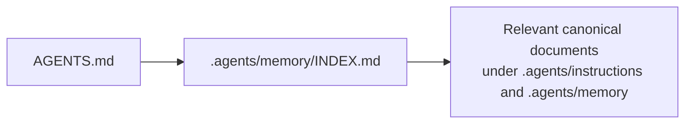
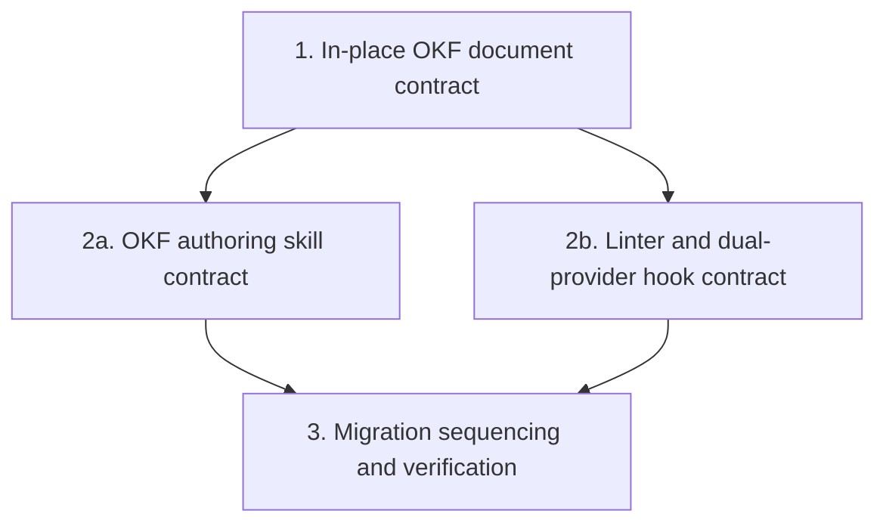

# OKF Knowledge-Base Migration: Corrected Overview

> The earlier sidecar, selector, context-injection, provider-adapter, and staged-rollout design is obsolete. Do not use its tickets as implementation instructions. The [migration map](map.md) is authoritative.

## The corrected idea

Agents already receive repository guidance through one established path:

The migration converts those canonical documents themselves to OKF v0.2. It does not generate a second knowledge bundle and does not inject selected knowledge into prompts. This keeps one source of truth and one loading path.

## What the design will cover

- **In-place OKF documents:** define how the existing canonical tree conforms to OKF without duplicating its content.
- **Progressive discovery:** retain `AGENTS.md` and `.agents/memory/INDEX.md` as the route coding agents already follow.
- **Authoring skill:** teach agents how to create and maintain conforming OKF documents in the canonical tree.
- **OKF linter:** validate the OKF standard, repository-specific rules, and relevant links with stable diagnostics.
- **Blocking provider hooks:** run lint validation for both GitHub Copilot CLI and Gemini CLI and block invalid document edits using each host's supported validation lifecycle.
- **Existing ingestion safety:** preserve immutable raw sources and current source-summary freshness behavior; linting validates authored OKF documents rather than replacing or duplicating ingestion.

## Remaining design sequence

Implementation has not started. The three open decision tickets in the [migration map](map.md) must close before an implementation ExecPlan is written; **OKF Authoring Skill Contract** and **OKF Linter and Provider Hooks Contract** are the current frontier tickets.
