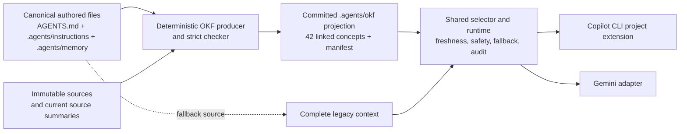
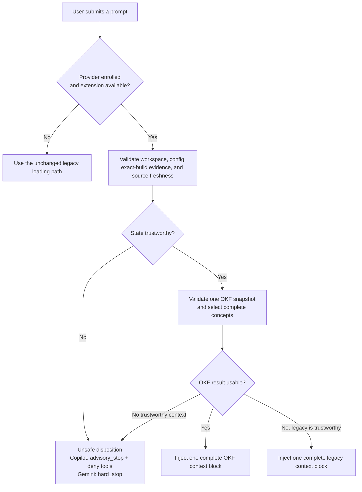
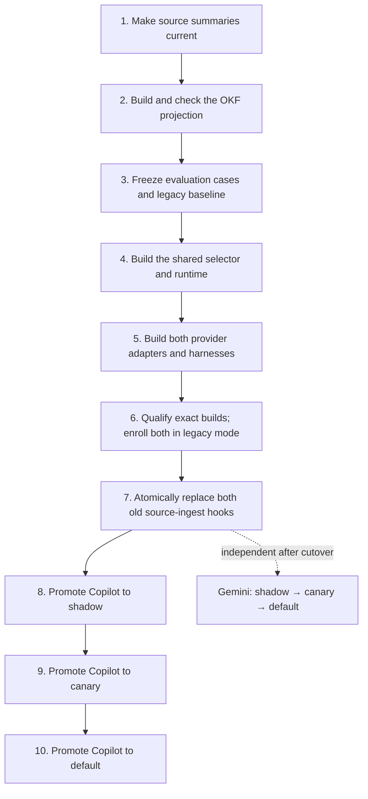

# OKF Knowledge-Base Migration: Implementation Overview

This page explains the planned migration in plain language. It is an orientation aid, not a new source of design decisions. The authoritative decisions and links remain in the [migration map](map.md), and implementation has not started yet.

## The idea in one minute

Today, an agent begins with a broad set of repository instructions and follows links to load more knowledge. The migration will keep those authored files as the source of truth, then generate an additional Open Knowledge Format (OKF) view that divides the knowledge into small, named concepts.

For each prompt, a deterministic local program will choose the concepts needed for that task. GitHub Copilot CLI and Gemini will use thin provider-specific adapters around the same shared selector and runtime. If the new path cannot be trusted, the system will either load the complete legacy context or enter the provider's safe-stop behavior. It will never combine a partial OKF result with legacy context.

The practical goal is to give an agent the right repository knowledge with less irrelevant material, while preserving mandatory instructions, offline operation, existing authored documents, and a safe rollback path.

## What will be built



The main pieces are:

- **Profile and projection:** a versioned description of how the existing knowledge becomes 42 concepts, plus a generator that produces the same bytes every time from the same inputs.
- **Selector:** an offline, deterministic program that ranks concepts for the current prompt, includes mandatory dependencies, and stays within a configured size budget.
- **Shared runtime:** one standard-library Python boundary that validates the workspace and configuration, checks source freshness, invokes selection, chooses OKF or legacy context atomically, and returns privacy-safe result metadata.
- **Copilot adapter:** a repository-scoped project extension that calls the runtime for every eligible prompt and injects exactly one hidden context block into the normal Copilot CLI experience.
- **Gemini adapter:** a provider-specific envelope over the same runtime behavior. It remains fully implemented, tested, and independently promotable.
- **Evaluation and qualification:** frozen examples and expected results, deterministic adapter harnesses, live checks against exact CLI builds, and digest-bound evidence required before enrollment or promotion.
- **Rollout configuration:** committed state that moves each provider independently through `legacy`, `shadow`, `canary`, and `default`.

## What happens when an agent receives a prompt



Three outcomes matter:

- `use_okf` means the selected OKF concepts are valid and are injected as one complete block.
- `use_legacy` means the new path failed in a recoverable way and the complete established knowledge-base entry points are injected instead.
- An unsafe result means trustworthy context cannot be established. Gemini can stop the turn with its native `hard_stop`. Copilot can deny all tools and inject an `advisory_stop`, but the standard Copilot CLI cannot guarantee that the model never sees the prompt or emits text. The implementation will state that limitation plainly.

## How implementation will proceed

The work is divided into ten acceptance gates. A gate is a checkpoint: its code, tests, generated files, documentation, and evidence must pass before the next gate begins.



| Gates | Novice description | Important protection |
| --- | --- | --- |
| 1–4 | Prepare trustworthy inputs, generate the new knowledge view, freeze the tests, and build the shared decision engine. | The legacy system remains authoritative. |
| 5–6 | Connect both CLIs without changing production behavior, then prove each exact deployment build behaves correctly. | A `fail` or `incomplete` result stops progress. |
| 7 | Remove both old provider-specific source-ingest paths in one change after the replacements prove parity. | Never leave one provider half-migrated or inject context twice. |
| 8 | Run Copilot's complete candidate path invisibly while still serving legacy context. | Observe at least one normal work cycle and 50 eligible prompts. |
| 9 | Serve OKF only in explicitly designated Copilot branches or worktrees. | Roll back on safety failures or sustained operational regression. |
| 10 | Serve OKF by default in Copilot, retaining atomic legacy fallback. | This completes the migration; Gemini continues independently. |

Each gate has one implementation owner and an independent reviewer. Build and cutover gates land as atomic commits so they can be reverted as units. Copilot promotion gates change only the rollout configuration. A defect in shared code returns every enrolled provider to `legacy`; a provider-only defect rolls back only that provider.

## What will stay the same

- Humans continue editing `AGENTS.md`, `.agents/instructions/`, `.agents/memory/`, and the existing source-summary inputs. Generated OKF files are not the authoring source.
- `.agents/sources/` remains immutable, and source freshness continues to be checked against its manifest.
- Selection and enrollment work offline. Runtime code does not fetch evidence, repair configuration, or rewrite the committed projection.
- Existing unrelated observability, secret-scanning, Tool Guardian, skill-loading, and other hooks remain independent.
- Published `skills/`, `agents/`, and `references/` content is outside this migration.
- Gemini support is retained. Copilot reaches `default` first, while Gemini advances on its own evidence and schedule.

## How success will be proved

The implementation will expose four stable acceptance commands:

```text
python3 scripts/okf-projection.py generate
python3 scripts/okf-projection.py check
python3 -m unittest discover -s scripts/tests/agent_kb -p 'test_*.py'
python3 scripts/agent-kb-evaluate.py --partition promotion --provider all --format json
```

The checks cover deterministic output, all 42 concepts, mandatory context, ranking and budgets, atomic fallback, failure handling, provider parity, privacy sentinels, lifecycle behavior, and latency. Live qualification is tied to the exact provider build, adapter, platform, runtime, configuration, and contract digests; evidence for one deployment tuple cannot silently qualify another.

## Where to go for detail

- [Migration map](map.md) — authoritative index of all accepted decisions.
- [Implementation sequencing](tickets/copilot-first-implementation-sequencing-and-handoff.md) — exact gate ownership, paths, checks, commits, and rollback boundaries.
- [Runtime contract](tickets/copilot-first-runtime-contract.md) — provider behavior and the Copilot `advisory_stop` limitation.
- [Provider integration and state](tickets/copilot-first-provider-integration-and-state.md) — request protocol, workspace validation, lifecycle, freshness, and privacy rules.
- [Evaluation amendment](tickets/dual-provider-evaluation-amendment.md) — shared and provider-specific qualification evidence.
- [Rollout and rollback](tickets/copilot-first-rollout-and-rollback.md) — observation windows, promotion rules, and rollback triggers.

The next implementation action remains unchanged: write the dependency-ordered ExecPlan, recheck the OKF v0.2 primary-source baseline, assign gate 1 ownership, and begin gate 1 only.
